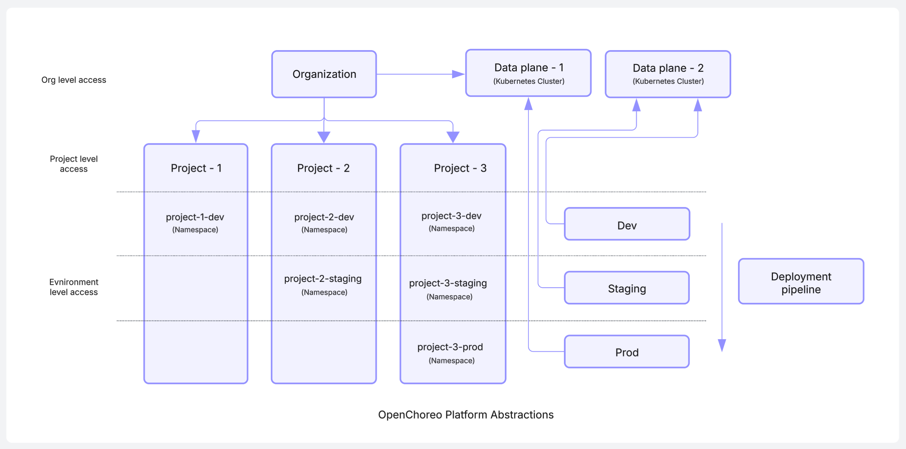
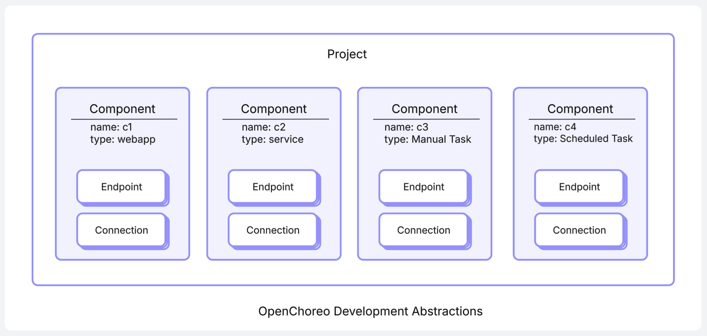
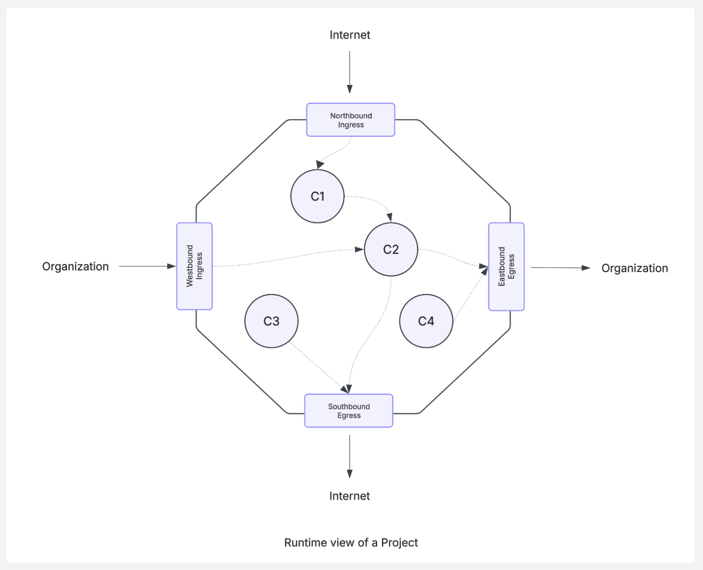
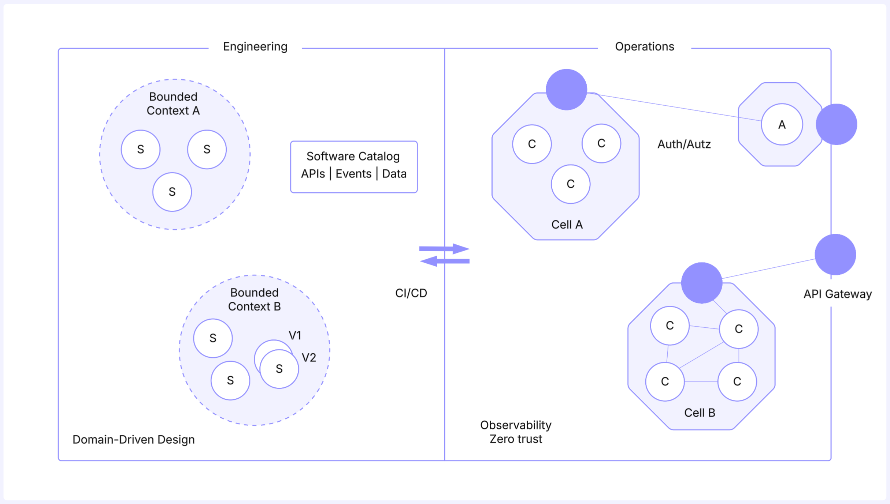
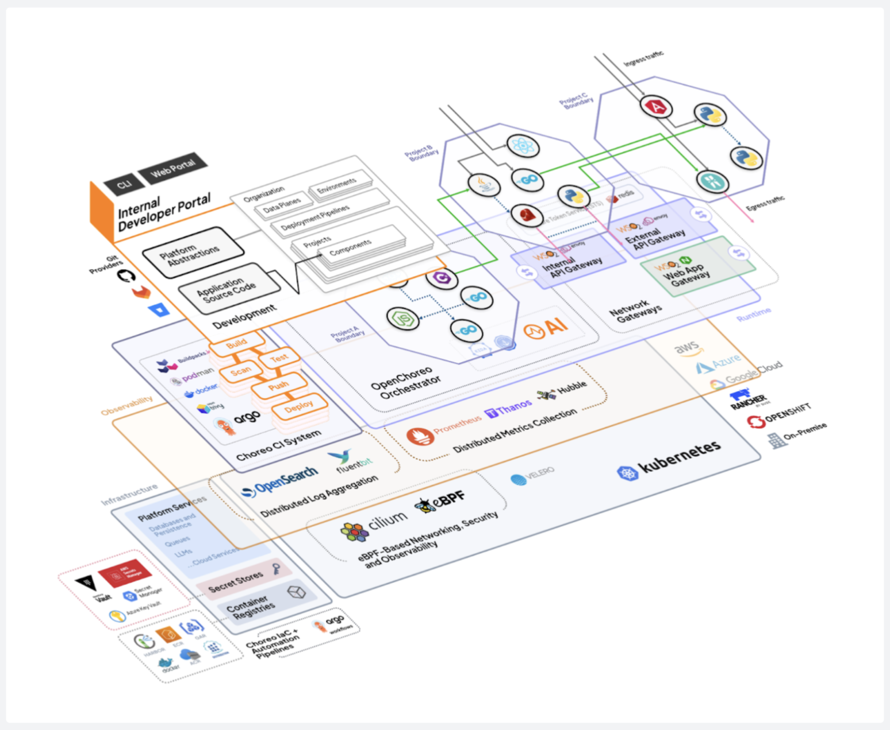

# OpenChoreo
Internal Developer Platform

OpenChoreo is a complete, open-source Internal Developer Platform (IDP) designed for platform engineering (PE) teams who want to streamline developer workflows and deliver Internal Developer Portals to them without building everything from scratch. Choreo orchestrates many CNCF and other projects to give a comprehensive framework for PE teams to build the platform they want.

## Why OpenChoreo?
Kubernetes gives you powerful primitives like Namespaces, Deployments, CronJobs, Services and NetworkPolicies—but they’re too low-level for most developers.

Platform engineers are left to build the actual platform: defining higher-level abstractions and wiring together tools for engineering, delivery, security and visibility.

OpenChoreo fills that gap and provides all the essential building blocks of an IDP, including CI, GitOps, observability, RBAC and analytics.

With OpenChoreo, we're bringing the best ideas of [WSO2 Choreo](https://choreo.dev) (an IDP as a Service) to the open-source community. WSO2 Choreo is designed not just to automate software delivery workflows, but to support engineering best practices: enforcing architecture standards, promoting service reuse, and integrating API management and observability.

## OpenChoreo concepts
At its core, OpenChoreo provides a control plane that sits on top of one or more Kubernetes clusters, turning them into a cohesive internal developer platform. 

OpenChoreo introduces a combination of platform abstractions and application abstractions, enabling platform engineers to define standards and enforce policies while giving developers a simplified, self-service experience.

Platform engineers use the following abstractions to create their internal developer platform:

  

 

- **Organization**
  - A logical grouping of users and resources, typically aligned to a company, business unit, or team. 
- **Data Plane**
  - A Kubernetes cluster to host one or more of your deployment environments.
- **Environment**
  - Separate runtime contexts such as dev, test, staging, and prod for workloads to execute.
- **Deployment Pipeline**
  - A defined process that governs how workloads are promoted across environments.

 

Project managers, architects, and developers use the following abstractions to manage the organization of their work:

  

 

These abstractions align with the Domain-Driven Design principles, where projects represent bounded contexts and components model services within these domains. Developers use these abstractions to describe the structure and the intent of the application in a declarative manner without having to deal with runtime infrastructure details. 

- **Project**
  - A cloud-native application composed of multiple components. Serves as the unit of isolation.
  - Maps to a set of Namespaces (one per Environment) in one or more Data planes.
- **Component**
  - A deployable unit within a project, such as a web service, API, worker, or scheduled task.
  - Maps to workload resources like Deployment, Job, or StatefulSet.
- **Endpoint**
  - A network-accessible interface exposed by a component, including routing rules, supported protocols, and visibility scopes (e.g., public, organization, project).
  - Maps to HTTPRoute (for HTTP), Service resources, and routes via shared ingress gateways. Visibility is enforced via Cilium network policies.
- **Connection**
  - An outbound service dependency is defined by a component, targeting either other components or external systems.
  - Maps to Cilium network policies and are routed via egress gateways.

 

Architects and developers use the following runtime abstractions to manage how components and projects operate at runtime:

  

 

At runtime, OpenChoreo turns each Project (Bounded Context) into a Cell, a secure, isolated, and observable unit that enforces domain boundaries through infrastructure. 

- **Cell** 
  - A Cell is the runtime reification of a single project in OpenChoreo. It encapsulates all components of a project and controls how they communicate internally and externally through well-defined ingress and egress paths.
  - Communication between components in the same cell is permitted without interception.
  - Cilium and eBPF are used to enforce fine-grained network policies across all ingress and egress paths.
- **Northbound Ingress**
  - Routes incoming traffic from external (Internet) sources into the cell.  
  - Endpoints with `visibility: public` are exposed through this ingress path.
- **Southbound Egress**
  - Handles outbound Internet access from components in the Cell. Connections to external services are routed through this egress path. 
- **Westbound Ingress**
  - Handles traffic entering the Cell from within the organization, be it from another cell or just from the internal network. 
  - Endpoints with `visibility: organization` are exposed through this ingress path.
- **Eastbound Egress**
  - Handles outbound traffic to other cells or to the internal network.

## OpenChoreo benefits
These abstractions provide the following benefits for businesses to build & operate cloud-native applications:

  

 

- **Design clarity for cloud-native applications**
  - OpenChoreo’s abstractions—Projects, Components, Endpoints, and Connections—enable teams to model systems around business domains. 
  - These abstractions align with Domain-Driven Design (DDD) and promote modular, independently deployable services with explicit service boundaries.
- **A developer experience that hides the infrastructure**
  - Developers define application intent (e.g., deploy a component, expose an endpoint, connect to another service) through high-level abstractions. 
  - OpenChoreo compiles this model into the necessary Kubernetes resources, network policies, gateways, and observability hooks.
- **Built-in ingress and egress API management**
  - OpenChoreo manages ingress and egress for all Components based on endpoint visibility (public, organization, or project). 
  - APIs are exposed through Envoy gateways with built-in support for routing, rate limiting, authentication, and traffic policies — without requiring manual configuration.
- **Software catalog and discoverability**
  - All exposed APIs, events and data are automatically registered in an internal catalog. Metadata such as endpoint path, visibility, and owning project is included. 
  - This enables discovery and governance of service interfaces across teams and environments.
- **Zero trust security by default**
  - Each Cell acts as a security boundary where communication between components is explicitly declared and enforced. 
  - Internal and external traffic is governed by Cilium network policies and routed through Envoy gateways. All traffic, including intra-cell communication, is encrypted using mTLS. 
  - No implicit trust is granted — every access is authenticated, authorized, and policy-checked.
- **Observability by default**
  - Each Cell is instrumented for logging, metrics, and distributed tracing. Observability spans all ingress/egress gateways and component-to-component communication, with no additional configuration required. 
  - Collected data can be integrated into existing monitoring and analysis pipelines.
- **Developer and platform separation of concerns**
  - The platform team defines the rules (networking, security, observability, and operational policies). Application teams work within those boundaries by modeling their systems using OpenChoreo abstractions. 
  - This separation ensures consistency, security, and operational reliability at scale.

## How does it work?
In this section, we explain how the OpenChoreo abstractions for platform engineering, code & team organization, software architecture, software engineering and operations are mapping to Kubernetes abstractions and a set of CNCF and other tools that are used to ensure the higher level abstractions are properly maintained.

  

 

## Getting Started

The easiest way to try OpenChoreo is by following the **[Quick Start Guide](./docs/quick-start-guide.md)**. It walks you through setting up Choreo using a Dev Container, so you can start experimenting without affecting your local environment.

For a deeper understanding of OpenChoreo’s architecture, see **[Choreo Concepts](./docs/choreo-concepts.md)**.

Visit **[Installation Guide](./docs/install-guide.md)** to learn more about installation methods.

## Samples

Explore hands-on examples to help you configure and deploy applications using OpenChoreo.

- **[Configuring Choreo](./samples/configuring-choreo/)** – Set up organizations, environments, data planes, and deployment pipelines.
- **[Deploying Applications](./samples/deploying-applications/)** – Deploy services, web apps, and scheduled tasks.

Check out the **[Samples Directory](./samples/)** for more details.

## Join the Community & Contribute

We’d love for you to be part of OpenChoreo’s journey! 
Whether you’re fixing a bug, improving documentation, or suggesting new features, every contribution counts.

- **[Contributor Guide](./docs/contributors/README.md)** – Learn how to get started.
- **[Report an Issue](https://github.com/openchoreo/openchoreo/issues)** – Help us improve Choreo.
- **[Join our Discord](https://discord.gg/asqDFC8suT)** – Be part of the community.

We’re excited to have you onboard!

## Roadmap
Explore the OpenChoreo roadmap, including completed milestones and upcoming plans, in our **[Roadmap]( https://github.com/orgs/openchoreo/projects/1)**.

## License
OpenChoreo is licensed under Apache 2.0. See the **[LICENSE](./LICENSE)** file for full details.

