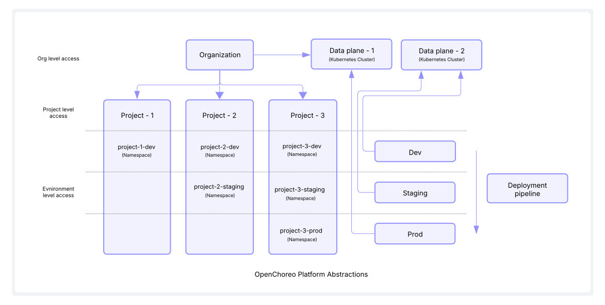
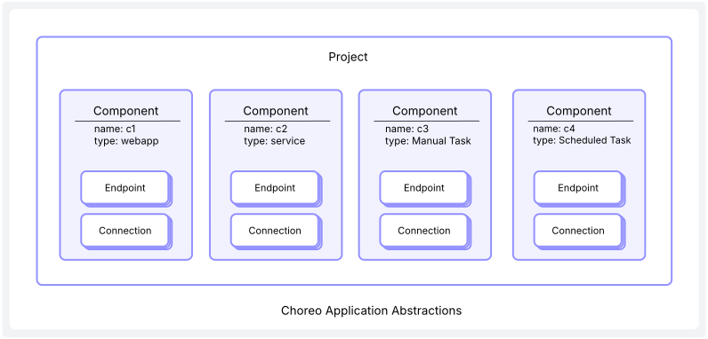
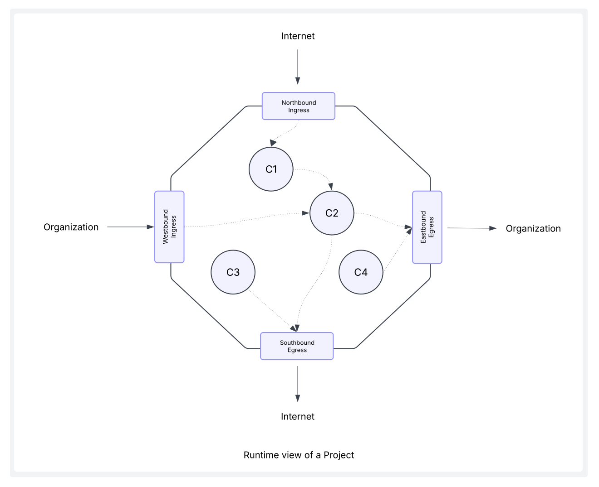

# OpenChoreo
Internal Developer Platform

OpenChoreo is a complete, open-source Internal Developer Platform (IDP) designed for platform engineering (PE) teams who want to streamline developer workflows and deliver internal developer portals to them without building everything from scratch. Choreo orchestrates many CNCF and other projects to give a comprehensive framework for PE teams to build the platform they want.

## Why OpenChoreo?
Kubernetes gives you powerful primitives like Namespaces, Deployments, CronJobs, Services, and NetworkPolicies—but they’re too low-level for most developers.

Platform engineers are left to build the actual platform: defining higher-level abstractions and wiring together tools for delivery, access control, and visibility.

OpenChoreo fills that gap by providing developer-friendly abstractions, along with the essential building blocks of an IDP: GitOps, observability, RBAC, and analytics, all available out of the box.

With OpenChoreo, we're bringing the best ideas of [WSO2 Choreo](https://choreo.dev/) (an IDP as a Service) to the open-source community. WSO2 Choreo is designed not just to automate software delivery workflows, but to support engineering best practices: enforcing architecture standards, promoting service reuse, and integrating API management and observability.

## OpenChoreo concepts
At its core, OpenChoreo provides a control plane that sits on top of one or more Kubernetes clusters, turning them into a cohesive internal developer platform.

OpenChoreo introduces a combination of platform abstractions and application abstractions, enabling platform engineers to define standards and enforce policies while giving developers a simplified, self-service experience.

Platform engineers use the following abstractions to create their internal developer platform:

| OpenChoreo Concept  | Description                                                                                        |
|---------------------|----------------------------------------------------------------------------------------------------|
| Organization        | A logical grouping of users and resources, typically aligned to a company, business unit, or team. |
| Data Plane          | A Kubernetes cluster to host one or more of your deployment environments.                          |
| Environment         | Separate runtime contexts such as dev, test, staging, and prod for workloads to execute.           |
| Deployment Pipeline | A defined process that governs how workloads are promoted across environments.                     |

Project managers, architects, and developers use the following abstractions to manage the organization of their work:

| OpenChoreo Concept | Description                                                                                                                                                       | Kubernetes Mapping                                                                                                                           |
|---------|-------------------------------------------------------------------------------------------------------------------------------------------------------------------|----------------------------------------------------------------------------------------------------------------------------------------------|
| Project | A cloud-native application composed of multiple components. Serves as the unit of isolation.                                                                      | Maps to a set of Namespaces (one per Environemt) in one or more Data planes.                                                                 |
| Component | A deployable unit within a project, such as a web service, API, worker, or scheduled task.                                                                        | Maps to workload resources like Deployment, Job, or StatefulSet.                                                                             |
| Endpoint | A network-accessible interface exposed by a component, including routing rules, supported protocols, and visibility scopes (e.g., public, organization, project). | Maps to HTTPRoute (for HTTP), Service resources, and routes via shared ingress gateways. Visibility is enforced via Cilium network policies. |
| Connection | An outbound service dependency defined by a component, targeting either other components or external systems.                                                     | Translated into Cilium network policies and routed via egress gateways.                                                                      |

Architects and developers use the following runtime abstractions to manage how components and projects operate at runtime:

At runtime, each Project in OpenChoreo is represented as a Cell - an isolated boundary for execution and communication. A cell encapsulates its Components, along with their Endpoints and Connections. OpenChoreo uses this information to configure ingress and egress gateways, network policies (Cilium), and routing rules (Envoy Gateways) to enforce visibility, trust, and policy between cells.

## Getting Started

The easiest way to try OpenChoreo is by following the **[Quick Start Guide](./docs/quick-start-guide.md)**. It walks you through setting up Choreo using a Dev Container, so you can start experimenting without affecting your local environment.

For a deeper understanding of OpenChoreo’s architecture, see **[Choreo Concepts](./docs/choreo-concepts.md)**.

Visit **[Installation Guide](./docs/install-guide.md)** to learn more about installation methods.

## Samples

Explore hands-on examples to help you configure and deploy applications using OpenChoreo.

- **[Configuring Choreo](./samples/configuring-choreo/)** – Set up organizations, environments, data planes, and deployment pipelines.
- **[Deploying Applications](./samples/deploying-applications/)** – Deploy services, web apps, and scheduled tasks.

Check out the **[Samples Directory](./samples/)** for more details.

## Join the Community & Contribute

We’d love for you to be part of OpenChoreo’s journey! 
Whether you’re fixing a bug, improving documentation, or suggesting new features, every contribution counts.

- **[Contributor Guide](./docs/contributors/README.md)** – Learn how to get started.
- **[Report an Issue](https://github.com/openchoreo/openchoreo/issues)** – Help us improve Choreo.
- **[Join our Discord](https://discord.gg/asqDFC8suT)** – Be part of the community.

We’re excited to have you onboard!

## Roadmap
Explore the OpenChoreo roadmap, including completed milestones and upcoming plans, in our **[Roadmap]( https://github.com/orgs/openchoreo/projects/1)**.

## License
OpenChoreo is licensed under Apache 2.0. See the **[LICENSE](./LICENSE)** file for full details.

